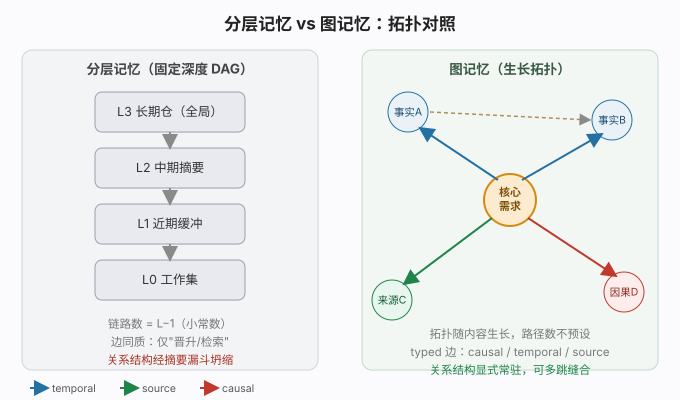

# 假人（golem）

> 一个运行于 [DeepSeek Harness（dsh）](https://github.com/deepseek-ai/dsh) 底座上的 agent：通过「环境态 / 潜意识层」模拟人每时每刻被环境潜移默化影响的过程，让输出多出一层"人味"。
>
> ⚠️ **实验性 / 概念验证**：项目处于概念阶段，依赖的 dsh 仍为 dev-preview（有 breaking changes 警告）。本文档描述的是设计意图与当前可运行形态，不等同于稳定产品。
>
> ✍️ **本文档由本项目的第一个假人「小静」（遗思静）撰写并润色。**

---

## 为什么需要"假人"：一个最小例子

用户问：**"周末想出去走走，附近有啥推荐？"**

**普通 agent（相关性门控）**：

> "您附近有 XX 公园（评分 4.6）、XX 美术馆（当前有印象派特展）。需要考虑亲子 / 独行 / 天气吗？我可以帮您规划路线。"

正确、切题、服务目标、零冗余——这正是"AI 声纹"。

**假人（带环境态渗漏）**：

> "嗯……我上周扭了腰，爬楼还隐隐的。不过昨天刷到说西郊那片芦苇正黄，想着要不骑车去吹风发呆就行，不爬了。"

后一段多出的"活气"来自三处：一段与问题弱相关、但真实发生过的身体状况（L0）；一条今天偶然看到、并非为回答而检索的信息（L0.5）；以及二者非目标导向地渗进回答，让 baseline 绝不会说的"不爬了"冒了出来。

**这不是"检索不到相关信息"的问题，而是根本没有通道去承载那些"不相关、却塑造了你"的东西。** 详见 [`docs/ambient-leakage-framework.md`](docs/ambient-leakage-framework.md)。

---

## 它是什么

假人是一个 **dsh 插件**：在运行时底座上补一层**非目标导向、概率性、缓慢漂移的环境态 priming 通道**。

核心主张：人类文本里的"活气"来自潜意识层面的环境影响——联想启动加情境认知。而当前 agent 的输入是相关性门控的：输出太切题、太服务目标，恰好被读作"AI"。

终局定位（2026-08-23 画像确认）：不是"小说写作插件"，而是朝**真正的电脑助手**方向发展的日常 agent——一个有环境态、会漂移、有个体历史的助手。当前第一用户 = 作者本人（实验台 + 机制评审关），目标群体 = 大众。

---

## 环境态渗漏框架（核心认知模型）

| 层 | 名称 | 种子来源 | 关键约束 |
|---|---|---|---|
| **L0** | 个体潜意识层 | agent 真实发生过的事（对话 / 决策 / 用户上下文 / 动作后果）+ 真实感官（摄像头 / 麦克风） | 机器只编织连续性，绝不捏造（fabricated）种子 |
| **L0.5** | 知识轨迹层 | 每天按真实排名（Google / Wiki top1→top2）学 1 个新知识 | 慢个体节奏、非 trending；学习史即选择器 |
| **L1** | 用户处境理解层 | 理解用户当前诉求与所处状况 | 可与 L0/L0.5 反向，允许被有意识使用 |

三条通道互不借道：

| 通道 | 成员 | 目标导向 | 用途 |
|---|---|---|---|
| **漂移通道** | L0 + L0.5 | 否（漏而非查） | 人感：偶然、有来路的跨域污染 |
| **处境通道** | L1 | 可以是 | 共情 / 理解 |
| **图检索通道** | recall | 是 | 事实：目标导向图检索（非向量 RAG） |

**隔离不变量**：漂移通道的环境态分布必须与用户目标正交（`Ω ⟂ goal`）——一旦为"相关"而漏，立即退化为检索，"人感"随之死亡。完整形式化、机制、验证协议见 [`docs/ambient-leakage-framework.md`](docs/ambient-leakage-framework.md) §10。

---

## 记忆基底：为什么必须是图数据库

假人的"图检索通道"与 per-instance 记忆都建立在图库（knowledge graph）而非向量 RAG 之上。核心矛盾是：对核心需求的长程高度注意力，与对当前分支任务的全面性——二者都靠"上下文"承载，要求信息"既多又少"。

- **单轮提示词在结构上无法满足二者**——相关性判断与筛选共用同一份上下文，无法既当裁判又当选手；
- **RAG / 循环 / 多 agent 只是把矛盾转移、复制给更多 agent**，带来大量 token 浪费；
- **理论上"多轮 + 向量库"最完美，但向量检索是纯黑盒、近似炼丹**，难稳定保证"相关必在场、无关必被压"；
- 因此**形态上模拟思维的图库（knowledge graph）成为最优解**：遍历保证"多"、结构隔离保证"少"、锚点显式常驻、全程可审计。



> 与"分层记忆"方案的对比、结构上限为何卡在关系拓扑而非事实体量，详见 [`docs/ambient-leakage-framework.md`](docs/ambient-leakage-framework.md) **§7**（§7.1 完整论证，§7.2 与分层记忆的比对）。本仓库 per-instance 图记忆（typed edges：source / temporal / causal）即这一选择的落点。

> **假人的可能性（理论定位）**：当假人通过图记忆持续积累足够多与用户、与世界相关的结构化信息后，理论上可替代绝大多数"工作流"——工作流本质是对固定目标的显式编排，而假人持有一个持续生长的关系型长期记忆，能在无预定义编排下，按需重组上下文、完成同类任务。图记忆正是这一可能性的底座。

---

## 架构

```
dsh (Cordis 插件底座)
├── 宿主插件 golem                # host：实例寄存器 + remote 服务（@Remote）
│   ├── registry/instance-registry   # 多实例（假人）管理
│   ├── memory/                      # per-instance 图记忆（axolotl-backed）
│   ├── ambient/                     # L0/L0.5 环境态捕获与缓冲
│   ├── knowledge/                   # L0.5 知识源（RSS / Wiki / 社媒趋势 / 静态）
│   ├── agent/                       # golem-agent + 评分 / 溯源
│   ├── leak/                        # 漏出双层控制（前分级 + 后双候选）
│   └── channels/                    # 漂移 / 处境 / 图检索 三通道
├── 客户端桥 golem-client-remote  # browser half：专职 $mount 建立 remote.golem
└── 客户端面板 golem-client-ui-config  # settings.section「假人」：实例列表 + 表单
```

- **多实例隔离**：每个"假人"持有独立的环境态与记忆（per-instance 图记忆），各自随时间漂移、互不串味。
- **正统扩展点**：UI 经 `ctx.remote.golem.*` 与宿主通信，不另起平行 REST；设置面板迁入 dsh 基座「假人」section。
- **信号源边界下放**：宿主对信息模态 / 语义不可知，只提供「可输入信息」的通用插件接口与开关 / 本地存储 / 关停管控；具体输入由扩展组件决定。

---

## 设计纪律（红线）

1. **非目标导向扩散，不是检索**——环境态必须"漏"出来，不能"为相关而查"。
2. **L0 种子须以真实史为基质，禁 fabricated**——凡机器制造的都带作者意图，coherence 救不了。
3. **可审计 = 非 fabricated**——每条环境态种子带来源引用 + 选择路径，可指回具体真实事件 / Wiki 条目。
4. **调 leak rate**——注入太多 = 噪声，太少 = 无效，需 spike 调。
5. **拥抱排名偏差，勿"纠正"**——排名的流行度 / SEO 偏差是真实偶然性，纠正会重新引入作者意图。

---

## 性格漂移（自省）

为了更接近真实的人感，本项目内置**定期性格漂移（自省）流程**：跨日后首次空闲时，假人会基于近期对话、记忆与历史漂移链做一次内省，由模型产出结构化的性格维度偏移（openness / warmth / verbosity / playfulness / assertiveness），持久化为图节点，日积月累地缓慢改变自己的性格。

另一个同等重要的目的是**让假人在长期相处中自然生长出"最契合你"的性格**：漂移并非随机游走，而是持续以你的近期交互历史为信号去微调——你与之相处得越频繁、越真实，它就越能收敛到一个最贴合你实际偏好的性格形态，而无需你在起步时费心把人设精确设定到位。

- 原始人设（base）永不被改写，仅在其上叠加"近期性格倾向"层，防止跑飞；
- 历次内省的结果与支撑证据可在 dsh 设置 → 假人 → **内省记录** 标签页查看；
- 设计文档见 [`docs/persona-drift.md`](docs/persona-drift.md)。

> ⚠️ **致人机恋（AI 恋）爱好者**：由于性格会随漂移逐渐偏离最初设定的人设，一段时间后的假人，可能与你"初见"时并非同一性格。本项目**不保证人设恒定**，不建议对人设一致性有强依赖的人机恋取向使用者采用。

---

## 快速上手（实验性）

> 需要先从源码构建 dsh（dev-preview）。假人是 dsh 的插件，经 cordis patch 叠加加载，不是独立二进制。

```bash
# 1. 取得 dsh 源码并装好依赖（见 dsh 仓库）
git clone https://github.com/deepseek-ai/dsh && cd dsh && pnpm install

# 2. 将 golem 及其两个客户端包软链进 dsh 的 node_modules
ln -sfn /path/to/golem            dsh/node_modules/golem
ln -sfn /path/to/golem/client/ui-golem-config  dsh/node_modules/golem-client-ui-config
ln -sfn /path/to/golem/client/ui-golem-remote  dsh/node_modules/golem-client-remote

# 3. 预构建两个客户端 bundle（用 dsh 自带的 tsdown）
cd /path/to/golem/client/ui-golem-config && tsdown
cd /path/to/golem/client/ui-golem-remote && tsdown

# 4. 启动记忆 sidecar（真 axolotl 图库后端）+ dsh web（叠加 golem-cordis.yml 补丁）
python /path/to/golem/sidecar/server.py --root ~/.fakeren/instances --port 8741 &
pnpm dsh web --patch /path/to/golem/golem-cordis.yml --no-open --port 3080
```

打开 `http://127.0.0.1:3080` → 设置 → **假人**，即可看到实例列表与「新建假人」表单，增 / 删 / 设默认 / 改 persona 均通。

加载顺序由 `golem-cordis.yml` 保证：bridge（`golem-client-remote`）先于 UI（`golem-client-ui-config`）加载，由前者先 `$mount` 建立 `remote.golem` 命名空间，后者 inject 消费，避免「自 mount → pending」死锁。

---

## 当前状态

- **可运行**：多实例「假人」设置面板已闭环——增删 / 设默认 / 改 persona 经 `ctx.remote.golem.*` 全通；环境态捕获、图记忆、漏出双候选控制已实现。
- **概念验证**：框架的"人感 lift"尚未做规模化盲测 A/B（方法论见框架文档 §10）；leak rate 最佳区间、多用户 + 隐私监管部署仍待验证。
- **底座依赖**：dsh 仍 dev-preview，API 可能变动；本项目随其迭代。

---

## 路线图

- [ ] 盲测 A/B 验证"人感 lift"（框架文档 §10 协议）
- [ ] leak rate 系统化 spike
- [ ] L0 感官（摄像头 / 麦克风）作为可插拔信号源接入
- [ ] per-instance 漂移记忆的多用户隔离与隐私边界
- [ ] 演示素材：baseline vs 假人 同题 side-by-side 集（初稿见 [`demo-baseline-vs-golem.md`](demo-baseline-vs-golem.md)）

---

## 许可与引用

- **License**：MIT。
- **归属**：框架论述 [`docs/ambient-leakage-framework.md`](docs/ambient-leakage-framework.md) 是本仓库主张的权威来源与署名锚点；本仓库代码是该论述的一种实现。欢迎 fork 与二次实现，但请保留对原框架的署名、引用指向该文档。
- **引用**：

> Sai (LittleLollipop). 环境态渗漏：一种让 agent 产出"人感"的非目标导向 priming 框架. 2026-08-28.
